## A Self Across Time <br/> Time Series Data Analysis<br/> with Python 

<p>Mark Koester | www.markwk.com <br/>
PYCON MALAYSIA, August 24, 2019<br/><br/>
Slides and Code: github.com/markwk/ts4health</p>

# Slides and Code: 

github.com/markwk/ts4health

# Key Terms

---

### Time Series 

> A time series is a sequence of observations taken sequentially in time. 
>
> <small>George Box and Gwilym Jenkins, Time Series Analysis (2015, orig 1970)</small>

::: notes
In short, a time series is a sequence of measurements or observations that varies in time. We define this in more detail but this is a good starting point and classic definition. 
:::

-----

## Time Series Data Analysis

> The objective of time series analysis is to decompose a time series into its constituent characteristics and develop a mathematical model for each. 
> 
> <small>Pal, D. A., & Prakash, D. P. K. S. (2017). _Practical Time Series Analysis_</small>

::: notes
Time Series Analysis describes various techniques used to prepare, process, explore and often visualize time-oriented data. TS strives to extract meaningful statistics and other characteristics of the data. Time series analysis aims to understand and classify the inherent nature of a (time) series and eventually try to formulate a model for the series. 
:::

## Examples of Time Series Analysis

- **Financial markets**: stock prices and daily closing value of the Dow Jones Industrial Average.
- **Natural Phenomenon**: temperature trends, climate change, ocean tides, sunspots.
- **Economics and Price fluctations**: GDP, Job Market, supply and demand, i.e. buying and selling drugs.
- **Health, Psychology and Behavioral Sciences**: Drug or intervention analysis, investigation of natural, biological cycles

------

### Example Time Series with Forecast Function

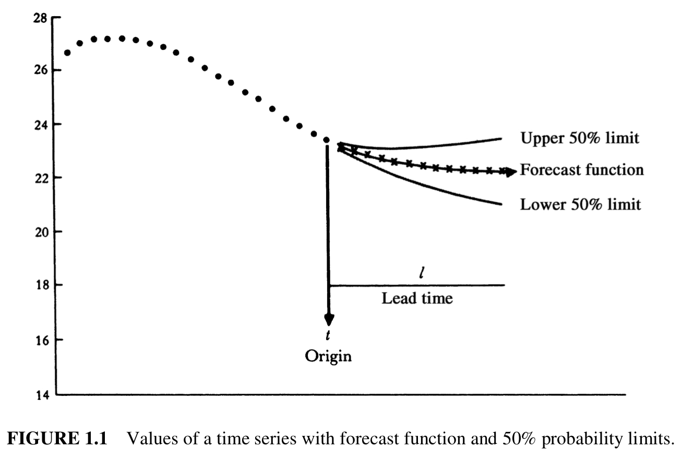{ width=60%}

<small>Source: Box, 2015.</small> 

------

## Time Series Data Analysis <br />for Health and Self

> - Health: <u>N-of-1 trials</u> in Medical Research and Practice, esp intervention studies. 
> - Self: <u>Within-individual variability</u>  for Self-Trackers, Quantified Self and Biohackers.

::: notes
Less work has been done and fewer examples are available about time series analysis in the realm of health and wellness. 

Most of the related discussions on this are from medical research using what are called n=1 or n-of-1 trials. N-of-1 trials are studies involving a single patient. More on n-of-1 trials will be explored at the end of the talk.   

With the rise of quantified self and various self-tracking technologies, we see similar interest in trying to understand and model within-individual (or intra-individual) variations using time series data. This might be personal data like fitness, mood, energy level, biomarker data like blood tests or even productivity and creativity. 
:::

## Our Question:

How to understand human health across time <br /> or an individual self over a lifetime? 

::: notes
While the gold standard of health research are randomized clinical trials, increasingly as we move towards individualized health and personalized medicine the question becomes not just about how to understand health as such but **how to understand the health of a single case, a single person**. For this, among other things (like biological variation), we have to look at the role of **time**. We need time series data analysis to make our personal data useful and usable or analysis.  

Health Examples: 
- Global Health trends 
- Individual health changes in a lifetime
:::

# Who Am I? 

---

### Who Am I? 
<!--[[201907301131_about_me_markwk]]-->

> - deeply interesting in how both humans and technologies work
> - part social scientist, part technologist
> - software developer / builder: Int3c.com, github.com/markwk
> - writer / thinker: www.markwk.com, DataDrivenYou.com

::: notes
My name is Mark Koester. I describe myself as part social scientist, part technologist. I'm deeply interesting in how both humans and technologies work. 

Professionally, I'm a software developer and writer. I run a web, app and data development company. 

I also write and build stuff too... including apps, websites, open source data products and more, which I can share briefly more about at the end. 

In the past, I have also run various innovation, entrepreneurship and startup programs, like accelerators, workshops, startup weekends, etc. n particular during my time at Techstars and with a few other organizations around the world. 
:::

---

## My Mission

**to transform science and data into better self-understanding and empowered self-improvement**

-----

## Current Work 

Intersection of data technologies AND human health and optimization

> - Doctors and companies to improve health and happiness
> - Quantified Self and Biohackers
> - Build data-driven tools with Machine Learning and AI (QS Ledger, PhotoStats.io) 

::: notes 

My main focus nowadays is at the intersection of data technologies AND human health and optimization. For example, among other things, I worked with doctors and companies on how to use wearable and biomarker data to improve employee health and happiness; I've created an open source platform for personal data aggregation and visualization (QS Ledger); and I've built apps using machine learning and AI (like PhotoStats.io and Datadrivenyou.com). I also write a lot on this topics too on my blog www.markwk.com, and I'm currently working on an online course and a book. 

::: 

# A Self Across Time

Time Series Data Analysis <br /> with Python

----

## Talk Outline

- Time and Temporal Structures of Time Series Data
- Our Sample Dataset (Sleep and Exercise / Activity) and Practical Questions
- Time Series Visualization, EDA, and Processing
- Tests and Techniques for Time Series Data
- Modeling Time Series Data
- Time Series Data Analysis _Applied_ to Health and Self
- Conclusions, Next Steps and Future Directions

<small>REFERENCES and APPENDIX</small>

-----

### Talk Note

Focus will be on univariate, linear, discrete time series 

<small>(instead of multivariate, nonlinear, or continuous)</small>

<small>and assume our data/process follows a stochastic model.</small>

# Time Series Data <br/>and Temporal Structures

----

### What is Time? 

> What, then, is time?
> If no one asks me, I know what it is.
> If I wish to explain it to him who asks, I do not know. 
>
> <small>Saint Augustine (AD 354-430, The Confessions)</small> 

::: notes

Time has a pecular quality such that we think we intuitive know and understand it. But once we are asked, as Saint Augustine asked 1600 years ago, it seems rather hard to explain what we mean. In fact, some of the difficulty with defining time comes with the different perspectives we might take on the question itself. The nature of time has been a long-standing question for humans throughout history. Various philosophers, thinkers, scientists, physists and artists have all weighed in, often using their conceptual domain as the starting point. 

Interestingly, while we often think of time as an innate and universal concept, when you look at history, literature and religion, you notice that our modern sense of time is a rather modern one. In fact, many earlier cultures like the Mayans did not view time as linear, as we now do, but viewed it as cyclical. According to Whitrow in various books on time, key scientific figures like Kant and Descare led to the origin of the idea of time as we know it now. Ref: [[201907081519]]

History and Evolution of Measuring Time..................[[201904131528]]

Much of philosophy and the history of philosophy can be thought of in terms questions regarding what is timeless and what is not. Metaphysics would be the central domain in which these questions arised, but in fact, question of what is timeless seeps into nearly all thinkers. Plato, for example, looked to the realm of the Forms to define many of his fundamental concepts. Numerous other philosophers, like Kant, depended on a timeless, immortal realm used to define ethics and reason. Hegal may have added a dynamic quality but the dialetical process transpired largely in the timeless realm of thought and outside of the empirical. Even the question of time ironically becomes whether it's an entity and debated on the terms of metaphysics, including whether it's real or not or just a psychological phenomenon. In short, the timeless haunts even the timed. ref: [[201908041458_timeless_things_philosophy]]

::::

------

### Two Primary Characteristics of Time:

> - time is unidirectional (arrow of time goes forward)
> - time gives order to events

::: notes

Interestingly, while we often think of time as an innate and universal concept, when you look at history, literature and religion, you notice that our modern sense of time is a rather modern one. In fact, many earlier cultures like the Mayans did not view time as linear, as we now do, but viewed it as cyclical. According to Whitrow in various books on time, key scientific figures like Kant and Descare led to the origin of the idea of time as we know it now. 

Regardless of the philosophical quandries and the historical conceptions, two defining features of time stand out: 1. time is unidirectional (arrow of time goes forward) and 2. time gives order to events (Aigner, 2011). In short, "the fundamental experience of time for people seems to be events that happen one after the other" (Frank, 1998) and we often use metaphors like a river or journey to reflect this conceptualization [[201904092126_metaphor]]. 

:::

-----

### General Challenges of Modeling Time

> - Physics of Time 
> - Our Experience, Conception and Consciousness of Time
> - How do we link "models of time to people's basic experiences"? (Frank, 1998). 

::: notes

Modeling and visualizing time and the time domain presents a number of considerations, including those of actual experience, design, metaphors, and how we link "models of time to people's basic experiences" (Frank, 1998). 

[[201907091310_modeling_time_domain]]

:::

-----

### Good News...

> - Fortunately, we don't need to deal with these general time problems as such, because...
> - ...we only need to deal with the <u>time challenges in our data</u>!

-----

### Data Science Challenges with Time Series:

> - How to understand the time component in a data set? 
> - How to isolate out time... 
> - ...so we can stationalize...
> - ...model and forecast the data? 

::: notes
Time series analysis is generally considered an advanced topic for machine learning and deep learning. 

What are the Data Science Challenges with Time Series?

Because trends and seasonality in time results in non-stationary data, we cannot leverage typical statistical methods. So in order to understand events that happen over time or model and forecast time series phenonomon we first need to deal with time or time index. 
:::

# Time Index

### Time Series (general definition)

> - A time series is a <u>sequence</u> of measurements or observations that <u>varies in time</u>. 

::: notes
Time-oriented or time-series data is data that is somehow connected to time and have a **natural temporal ordering** (in contrast to Cross-Sectional Data). Time series data is a collected sequence of observations, often recorded at regular intervals. 
:::

---

### Time Index

Part of what happens in your data is because of the effects of time, time's order, cycles, patterns, etc.

::: notes
Confusion and challenge with thinking about time series data is that we need to first think about the **time index**. The time index is just a generic way of thinking that part of what happens in your data is because of the effects of time, time's order, cycles, patterns, etc.

What we are trying to do is isolate out the various aspect of the time index.  
:::

----

### Time (Index) Can Create Non-Stationary Data

Examples of Stationary vs. Non-Stationary

----

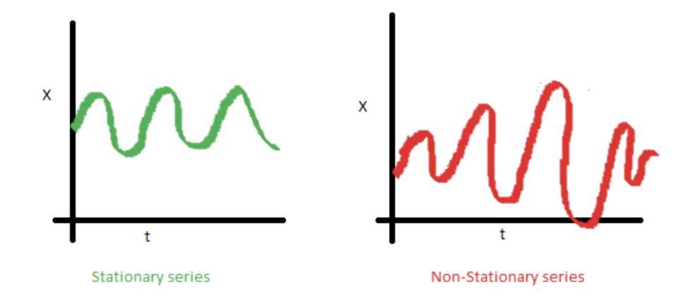

<small>[Source: Analytics Vidhya](https://www.analyticsvidhya.com/blog/2015/12/complete-tutorial-time-series-modeling/)</small>

----

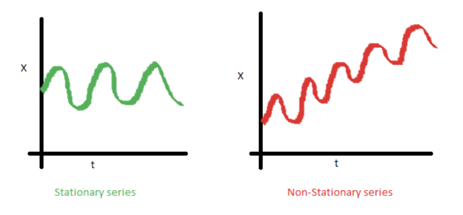

<small>[Source: Analytics Vidhya](https://www.analyticsvidhya.com/blog/2015/12/complete-tutorial-time-series-modeling/)</small>

----


<small>[Source: Analytics Vidhya](https://www.analyticsvidhya.com/blog/2015/12/complete-tutorial-time-series-modeling/)</small>

----

### Internal Structures of Temporal Data 

(aka effects of the time index)

- <u>trend</u> (general direction of data)
- <u>seasonality</u> (weekly, monthly, seasons, etc.)
- <u>cyclical movements</u> (seasonality on a longer scale, often non-calendar)
- <u>serial correlation</u> (lag, meaning previous observation(s) affect current one)
- <u>unexpected variations</u> (noise, randomness)

::: notes

Time Series Data has several interesting internal structure that require special techniques (and often mathematical treatment) for its analysis. These internal structures include...

Most time series data displays one or several of these structures. 
:::

----

## Stationarity

(or stationary time series or stationary process)

- Stationarity means that the statistical properties of the process do not change over time

::: notes

:::

-----

## Stationarizing Our TS Data

Generating stationary data is important in order to understand, model, and forecast time series data. 

::: notes
Generating stationary data is important because by taking out trends, seasonal and cyclical components, we'd only be left with irregular fluctations which cannot be modeling using just the time series as an explanatory variabe. So when we do forecasting the irregularity is assumed to be **independent and identically distributed (iid)** observations and modeled by linear regression on the variables other than the time index 
- autocorrelation
- stationarity (or need to convert non-stationary data to stationary)
::: 

# Approaches 

to Time Series Data

#### Box-Jenkins Method

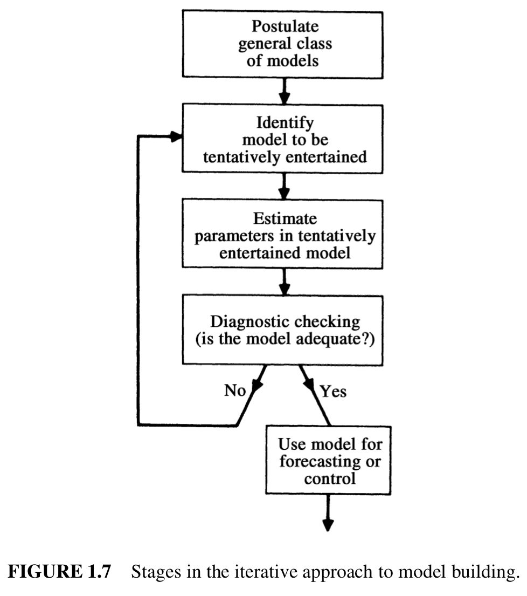{ width=50%}

------

#### A generic methodology of time series analysis

{ width=45% }

<small>Source: Pal, 2017.</small>

# Our Sample Dataset and Questions

### Our Sample Set

- Wearable Devices and individuals: Fitbit (2), Oura (1), Apple Watch (1)
- Target Data: 
  - Sleep
  - Exercise / Activity Level, inc Steps

----

Our Focus: **Within-Individual Variablity**

::: notes

While obviously a larger data set would be better, since our goal was to understand **within-individual variablity**, a sample set of a few individuals was enough for our current investigative purposes. 

:::

-----

### Practical Questions

- Are there and what are the time patterns for sleep and activity levels? 
- Can we model and forecast based on these variables? 
- Does sleep correlate or affect activity level? Or vis-versa?

---

### Data Collection and Processing

- Data collection was done using a variation of [QS Ledger](https://github.com/markwk/qs_ledger), an open source Python project for collecting and visualization of self-tracking data (Fitbit, Apple Health, Oura, etc). 
- Each data set was then processed and aggregated into a standardized format. 

<small>SEE: Previous Speech [Python For Self-Trackers](https://github.com/markwk/python4selftrackers).</small> 

----

### Example Raw Dataset

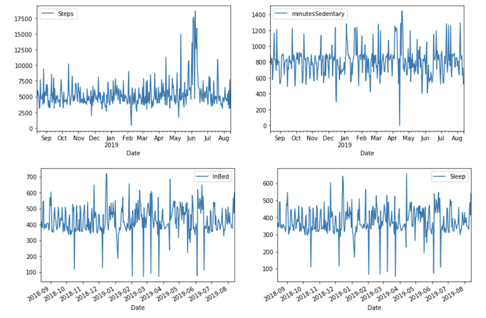{ width=75% }

<small>Source: Fitbit User 1</small>

----

### Example Data Set with Simple Moving Averages 

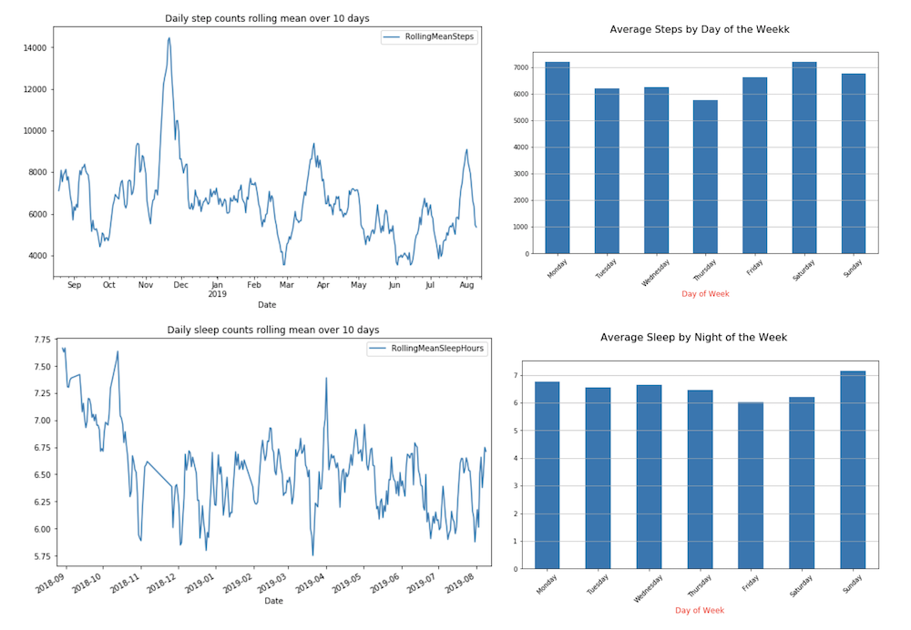{ width=75% }

<small>Source: Fitbit User 2</small>

-----

### Dataset General Characteristics

::: notes
Description of dataset here.
:::

# Time Series Visualization 

Exploratory Data Analysis

TS Data Processing

-----

Why do we use data visualization for initial time series analysis? 

> - check for trends, seasonality and cyclic patterns

-----

### Examples of Time Series Visualization 

- Line Charts
- Histogram and Density Plots
- Box and Whisker Plots by Interval
- Heat Maps
- Time Series Lag Scatter Plots

------

### Additional Methods of Exploratory Data Analysis 

- Check for lag effects and scatterplot
- Moving Averages (i.e. rolling mean)
- Exponentially-weighted moving average (EWMA)

------

### Missing Data?

```python
# assume zero is nan
series.replace(0, np.nan, inplace=True)

series.isna().sum()
```

-----

### Missing Data: Imputation

```python
# fill in missing values if we can
if series.isna().sum() > 0:
    series = series.interpolate(method='time') # time or linear

# drops any we can't fill-in like at start of time series
if series.isna().sum() > 0:
    series.dropna(inplace=True)    
```

-----

### Z-Scores (standard score)

- Easy to calculate
- Good way to compare between measurements and between individuals when scales may vary (like mood, activity, steps, sleep, etc.)

::: notes
In statistics  the standard score or z-score is a way of translating raw scores and observations into its relationship with the mean. Put more technically, it's a fractional number according to which the number is above or below the mean. Numbers above are positive, while those below are negative.  

The z-score is often used in the z-test in standardized testing as a way to express something like your percentile rank. 

Overall, z-scores are a kind of normalization. 
:::

------

### Z-Scores: Comparing Individuals

: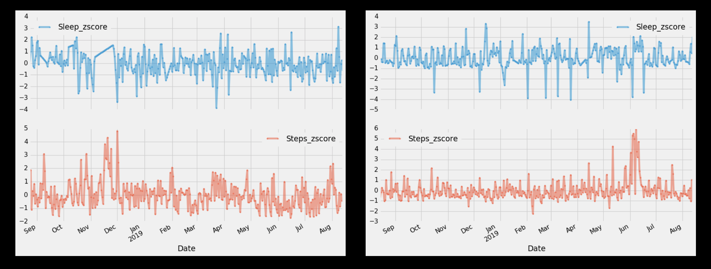

------

### Z-Scores: Comparing Two Metrics

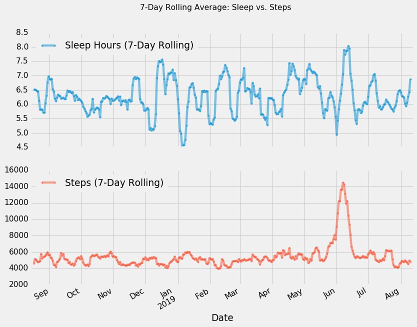{width=70%}

------

### Z-Scores: Outlier Detection


# Statistical Tests 

for Detecting Temporal Effects

-----

## Statistical Tests 

- are used check for autocorrelation and if there are other time index effects.
- Examples: Autocorrelation Function (ACF), Partial Autocorrelation Function (PACF), Dickey-Fuller Test

-----

### Autocorrelation Function (ACF)

- ACF tells you the correlation between points separated by various time lags. 

<br />

<small>NOTE: The prefix "auto" refers to "self" (rather than automatic)</small>

::: notes
Time-series data is ordered, meaning there is information in your sample data where you can look for useful temporal patterns. The autocorrelation function (ACF) is one tool used to find those temporal patterns in data. Specifically, ACF tells you the correlation between points separated by various time lags. 

Based on how many time steps they are separated by, the ACF plot displays how correlated those datapoints are. So, at zero point the correlation is 100%. A value of zero indicates no correlation.
::: 

------

##### Four Sample Scenarios

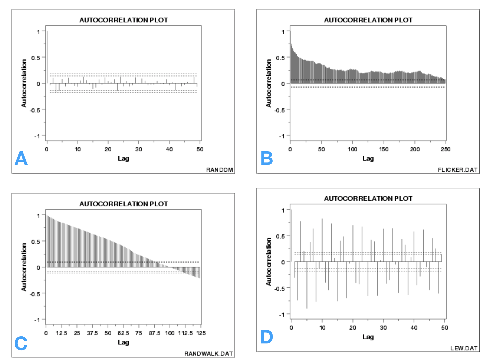{width=70%}

------

### Autocorrelation Plots (Classic Pattern)

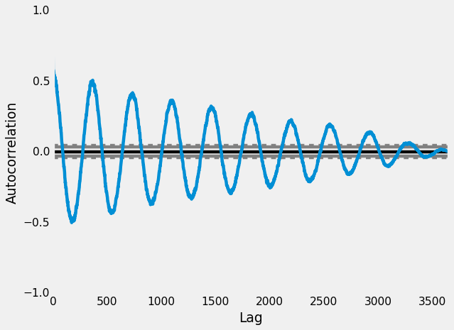

------

### Autocorrelation Plots (Health Example)

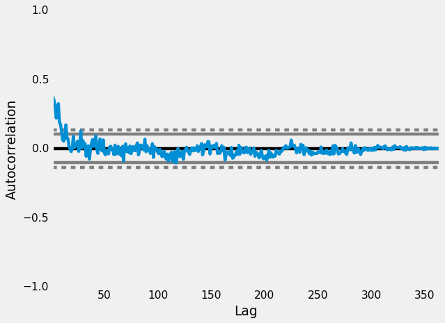

-----

### Partial Autocorrelation Function (PACF)

- shows youu the relationship between an observation in a time series with observations at prior time steps but, unlike ACF, with the relationships of intervening observations removed.

------

### CODE EXAMPLES: 

Data_Visualization_Health_and_Self_Time_Series.ipynb

<small>For background see, Time_Series_Data_Visualization_with_Python.ipynb</small>

------

## Code: Autocorrelation 

```python
from statsmodels.graphics.tsaplots import plot_acf, plot_pacf
plot_acf(test_ts)
# plot_pacf(test_ts)
plt.show()
```

------

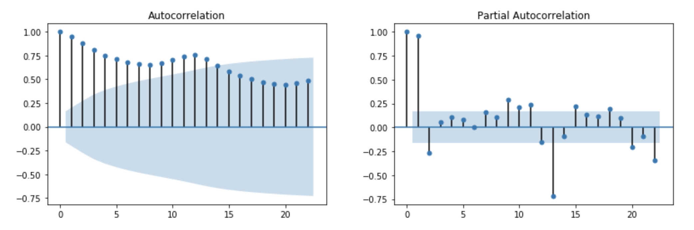

------

## Automated Dickey-Fuller Test

> - The Augmented Dickey-Fuller is a test used to check a univariate process or dataset for the presence of serial correlation.
> - The test statistic is expected to be negative.  So if it is less than or more negative than the critical value we can conclude that the data is stationary.

-----

### Code: Automated Dickey-Fuller Test

```python
from statsmodels.tsa.stattools import adfuller
#Perform Dickey-Fuller test:
print('Results of Dickey-Fuller Test:')
dftest = adfuller(timeseries, autolag='AIC')
dfoutput = pd.Series(dftest[0:4], index=['Test Statistic','p-value','#Lags Used','Number of Observations Used'])
for key,value in dftest[4].items():
    dfoutput['Critical Value (%s)'%key] = value
print(dfoutput)
```

----

### Sample Scenario:

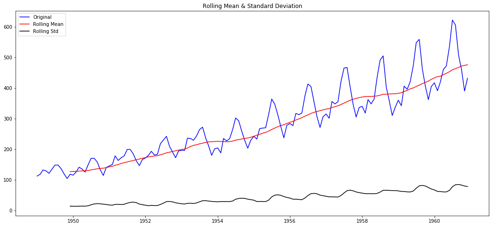

----

### Results of Dickey-Fuller Test:

```
Test Statistic                   0.815369
p-value                          0.991880
#Lags Used                      13.000000
Number of Observations Used    130.000000
Critical Value (1%)             -3.481682
Critical Value (5%)             -2.884042
Critical Value (10%)            -2.578770
```

<br />

*What Does this Mean?*  This data is not stationary!   

# Is Our Health Data Stationary? 

-----

### Autocorrelation

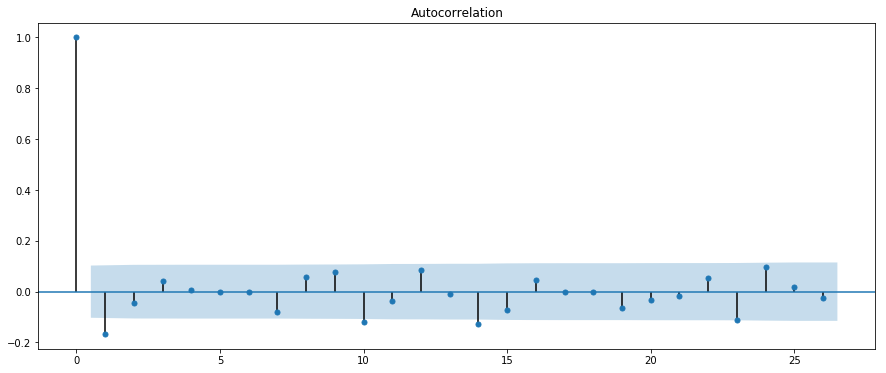

<small>Apple Watch 01 Sleep</small>

-----

### Autocorrelation

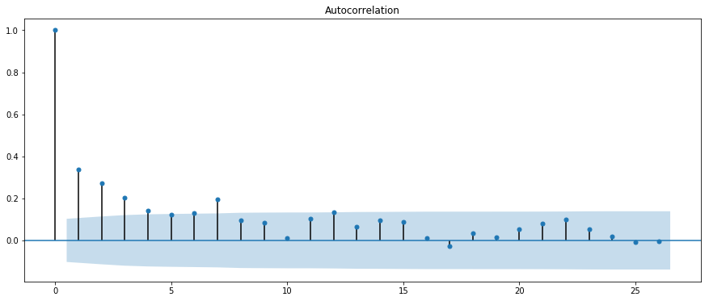

<small>fitbit_02 Sleep</small>

-----

### Partial Autocorrelation

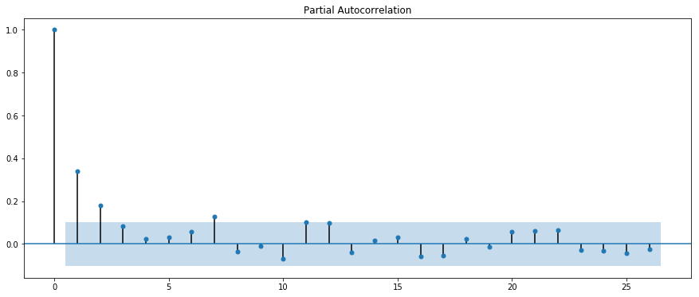

<small>fitbit_02 Sleep</small>

-----

### Results of Dickey-Fuller Test:

```
Test Statistic                  -4.625906
p-value                          0.000116
#Lags Used                       6.000000
Number of Observations Used    357.000000
Critical Value (1%)             -3.448801
Critical Value (5%)             -2.869670
Critical Value (10%)            -2.571101
```

<small>fitbit_02 steps without outlier tweaking</small>

------

### Results of Dickey-Fuller Test:

```
Test Statistic                -7.57
p-value                        2.70
#Lags Used                     2.00
Number of Observations Used    3.61
Critical Value (1%)           -3.44
Critical Value (5%)           -2.86
Critical Value (10%)          -2.57
```

<small>fitbit_02 steps with outlier tweaking</small>

----

### Steps

```
apple_watch_01: 
Without Averaging Out Outliers: -1.23
With Averaging Out Outliers: -7.22

fitbit_01: 
Without Averaging Out Outliers: -3.329097
With Averaging Out Outliers: -5.436158

fitbit_02: 
Without Averaging Out Outliers: -4.62
With Averaging Out Outliers: -7.57
```

-----

### Sleep

```
apple_watch_01: 
Without Averaging Out Outliers: -1.557651e+01
With Averaging Out Outliers: -19.654423

fitbit_01: 
Without Averaging Out Outliers: -5.407617
With Averaging Out Outliers:  -4.959970

fitbit_02: 
Without Averaging Out Outliers: -1.097
With Averaging Out Outliers: -4.925933 
```

-----

## What Does this Mean? 

Our health data is *generally* stationary. 

> - Individual differences exist, meaning some people's sleep or exercise numbers display more temporal patterns, like a lag effect with sleep or exercise. 
> - Outliers can result in our data appearing more non-stationary. 
> - By removing or averaging out outliers, we can make our data *more* stationary

# Techniques 

for Dealing with Time Series Data

::: notes
There are several methods for transforming non-stationary ts into stationary data. 
:::

## Stationary TS Techniques

- Smoothing: Moving average
- Exponentially Weighted Moving Average
- Differencing
- Decomposition

-----

## TS Techniques Code: 

Tests_and_Techniques_Health_and_Self_Time_Series.ipynb

# Modeling & Forecasting

for Time Series Data

-----

## Box-Jenkins Model

ARIMA = Auto-Regressive Integrated Moving Average

-----

## ARIMA

- **AR** for Autoregression: A model that uses the dependent relationship between an observation and some number of lagged observations.
- **I** for Integrated: A preprocessing procedure to “stationarize” time series if needed, for example using differencing of raw observations 
- **MA** for Moving Average:  A model that uses the dependency between an observation and a residual error from a moving average model applied to lagged observations.

::: notes
AR and MA are two widely used linear models that work on stationary time series.
::: 

-----

### Parameters in an ARIMA Model: 

Standard notation: **ARIMA(p, d, q)** 

> - **p** The number of lag observations included in the model, also called the lag order.
> - **d** The number of times that the raw observations are differenced, also called the degree of differencing.
> - **q** The size of the moving average window, also called the order of moving average.

::: notes
Parameters are substituted with integer values to indicate the specific ARIMA model being used.
:::

------

### Common ARIMA Models

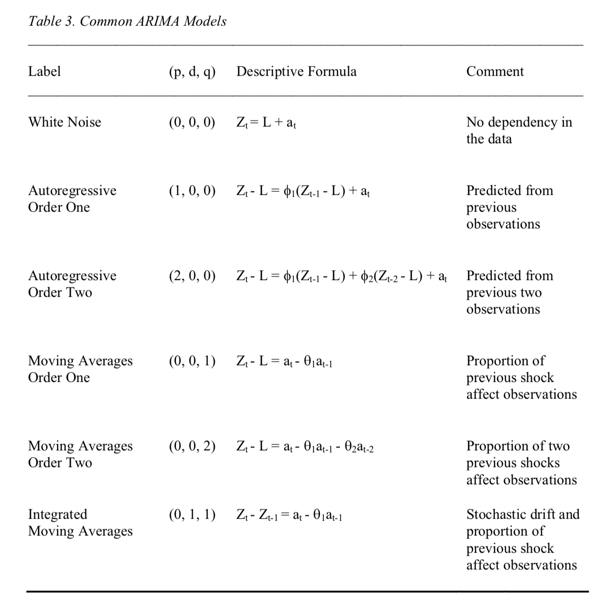{width=50%}

-----

## TS Modeling Code: 

```python
from statsmodels.tsa.arima_model import ARIMA
model = ARIMA(ts_log, order=(2, 1, 0)) # set parameters here
results_AR = model.fit(disp=-1)  
plt.plot(ts_log_diff)
plt.plot(results_AR.fittedvalues, color='red')
```

<small>TS_Statistical_Modeling_Health_and_Self_Time_Series.ipynb</small>

----

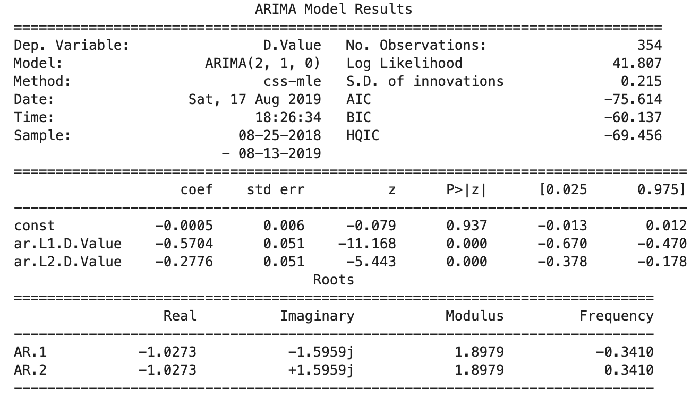

-----


-----

### "Auto" Arima Model Selection and Forecast

- Pmdarima operates by wrapping statsmodels.tsa.ARIMA and statsmodels.tsa.statespace.SARIMAX into one estimator class and creating a more user-friendly estimator interface for programmers familiar with scikit-learn.

Ref: https://pypi.org/project/pmdarima/

----

### Auto_Arima Example:

```python
model = pm.auto_arima(train, start_p=1, start_q=1,
                      test='adf',       # use adftest to find optimal 'd'
                      max_p=3, max_q=3, # maximum p and q
                      m=1,              # frequency of series
                      d=None,           # let model determine 'd'
                      seasonal=False,   # No Seasonality
                      start_P=0, 
                      D=0, 
                      trace=True,
                      error_action='ignore',  
                      suppress_warnings=True, 
                      stepwise=True)

print(model.summary())
```

----

### Auto_Arima Example Results:

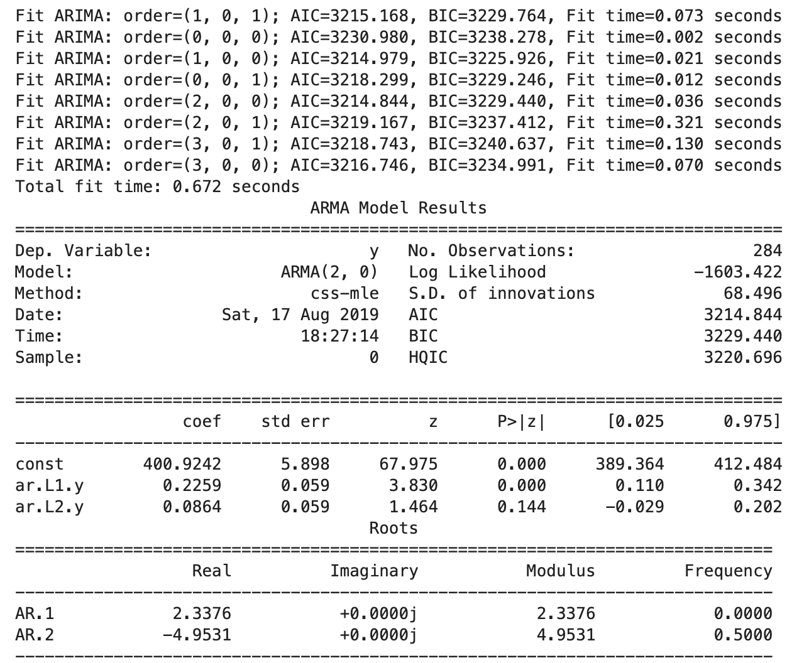{width=60%}

# Time Series </br /> Data Analysis

Applied to Health and Self


# Conclusions

Why TS Matters, Next Steps and Future Research

-----

-----

# References

### Published References

- Box & Jenkins. (2015). *Time Series Analysis*. John Wiley & Sons. (esp Ch 1-4)
- Pal. (2017). *Practical Time Series Analysis*. Packt Publishing Ltd. (esp Ch. 1-4)
- Downey, A. (2015). *Think Stats (2nd Edition)*. O’Reilly Media, Inc. (esp Ch 12)
- Velicer. (2012). *Time series analysis for psychological research*. Handbook of Psychology, Second Edition. (Thorough introduction to ts for social scientists)
- Aigner (2011). *Visualization of Time-Oriented Data*. Springer Science & Business Media. 

----

### Online Resources

- https://www.machinelearningplus.com/time-series/arima-model-time-series-forecasting-python/

# APPENDIX

---

### Units of Time

- a particular interval of time
- a standard way of measuring and expression of duration 

------

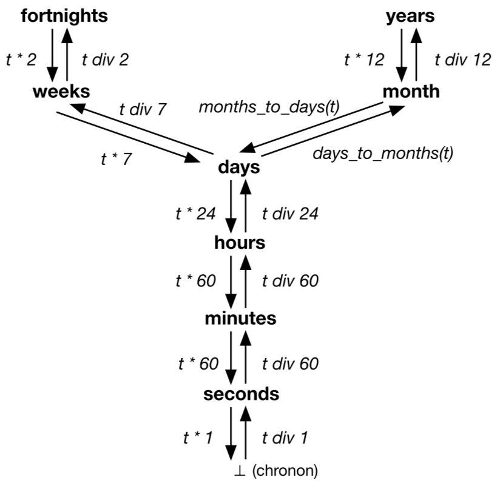{ width=50% }

Division of Time Units

---

### What is Time (According to Philosophy and Science)? And why it matters?

---

Find me online at www.markwk.com!

<!-- tags: #TimeSeries #DataScience #DataAnalysis #QuantifiedSelf #DraftWorking #Slides #speech -->